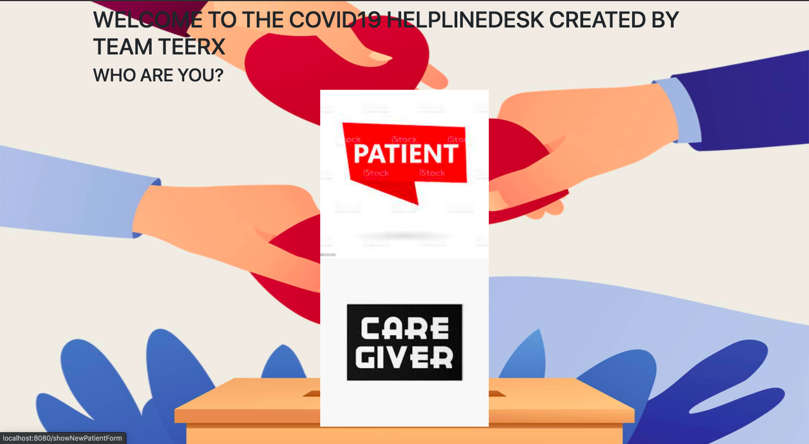
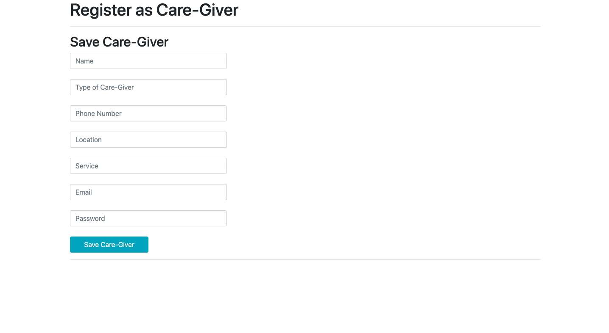
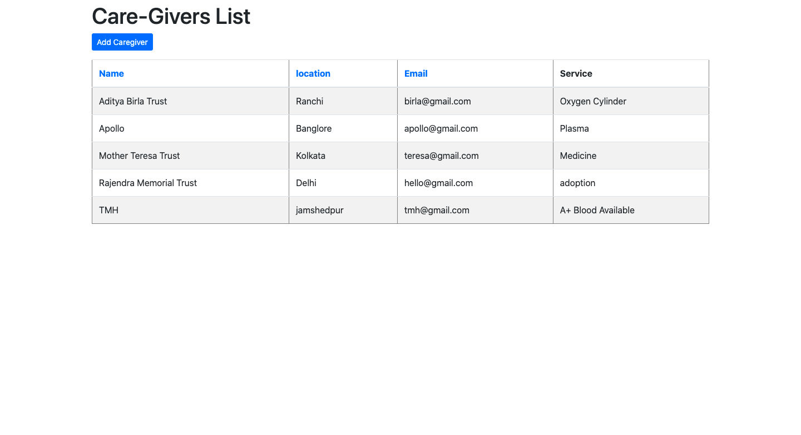
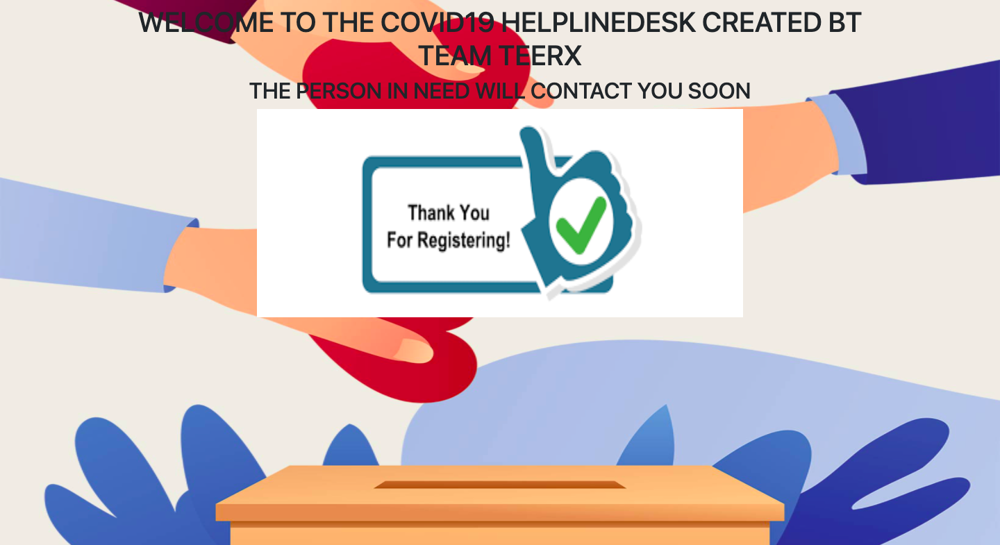

# COVID-Help-Finder

Over the last few weeks, India is badly hit by this second wave, and it’s not just numbers we are keeping an eye on. Since the second wave hit India, people of the nation have stepped up to help absolute strangers in whatever capacity they can. This portal can connect covid patient and their family to the volunteers who are helping around the country. The registered patient can checkout the list of all volunteers around his location and contact.

## Screenshots
<b>Register as Patient or Caregiver</b>

<b>Reistration Forms for Patient and Care-giver</b>

<b>List of Care-Givers for Patients</b>

<b>Registration Success page for Care-givers</b>

